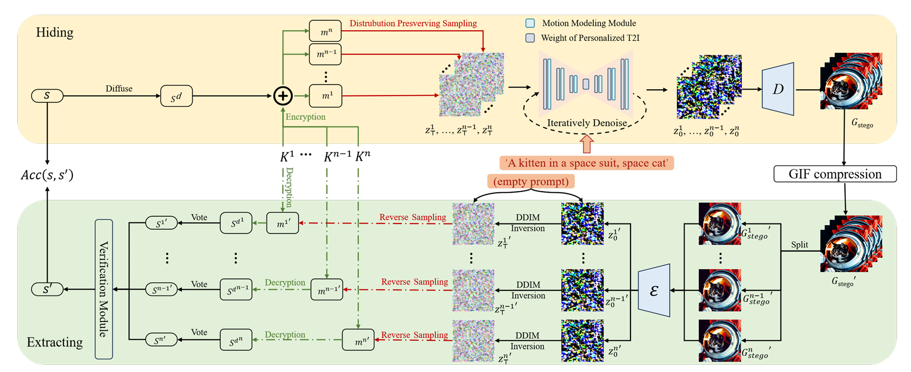

# Provable GIF Steganography

> **Provably Secure and Robust Training-Free GIF Steganography via Diffusion Models**
>
> *IEEE Transactions on Multimedia (TMM) 

[](LICENSE)
[](https://www.python.org/downloads/)
[](https://pytorch.org/)

---

## Overview

This repository is the official implementation of **Provably Secure and Robust Training-Free GIF Steganography via Diffusion Models**, accepted to *IEEE Transactions on Multimedia (TMM)*.

The core challenge of this work: extending single-image watermarking to multi-frame GIF animations while addressing two key issues — (1) extraction errors caused by GIF frame-level compression and distortion; (2) guaranteeing visual quality of the watermarked video without any model fine-tuning.

### Key Contributions

| Feature | Description |
|---------|-------------|
| **Cross-Frame Majority Voting** | Redundantly encode each watermark bit across all 16 GIF frames; at extraction, majority vote across frames resists per-frame compression and distortion without any training or fine-tuning |
| **Dual Cryptographic Modes** | Standard OTP mode (high accuracy) and ChaCha20 stream cipher mode (IND-CPA provable security); watermark embedding only modifies the initial latent of the diffusion model |
| **Lossless Visual Quality** | The initial latent is replaced rather than additively perturbed, so the diffusion model's generative distribution is preserved by construction |
| **Complete Sender-Receiver Pipeline** | Sender generates watermarked GIFs via AnimateDiff; Receiver extracts via DDIM inversion and majority voting, with no additional training required |

---

## Method



---

## Repository Structure

```
Provable-GIF-Stego/
├── core/
│   ├── __init__.py
│   ├── watermark_core.py          # Watermark generation (OTP & ChaCha20) + extraction (diffusion_inverse)
│   ├── pipeline_stego.py          # Sender pipeline: AnimateDiff integration + watermark injection
│   ├── inverse_stable_diffusion.py # Receiver DDIM inversion pipeline
│   ├── modified_stable_diffusion.py# SD pipeline base class (adapted from Gaussian Shading)
│   ├── image_utils.py             # Image pre/post-processing and distortion simulation
│   ├── io_utils.py                # I/O helpers and metric logging
│   └── optim_utils.py             # Evaluation utilities
├── scripts/
│   └── run_stego.py               # Main entry: hide (Sender) / extract (Receiver)
├── requirements.txt
├── .gitignore
├── LICENSE
└── README.md
```

---

## Installation

### 1. Clone this repository

```bash
git clone https://github.com/SRope-2/Provable-GIF-Stego.git
cd Provable-GIF-Stego
```

### 2. Create a Python environment

```bash
conda create -n gif-stego python=3.10 -y
conda activate gif-stego
pip install -r requirements.txt
```

### 3. Install AnimateDiff (required for the Sender / hide mode)

```bash
git clone https://github.com/guoyww/AnimateDiff.git
cd AnimateDiff
pip install -r requirements.txt
cd ..
```

AnimateDiff motion module weights can be downloaded from their [official release page](https://github.com/guoyww/AnimateDiff/releases).

### 4. Download Stable Diffusion v1-5 (required for the Receiver / extract mode)

```bash
# via huggingface-cli
huggingface-cli download runwayml/stable-diffusion-v1-5 --local-dir ./models/stable-diffusion-v1-5
```

Or download manually from [Hugging Face](https://huggingface.co/runwayml/stable-diffusion-v1-5).

---

## Quick Start

### Sender — Hide a Watermark into a GIF

```bash
python scripts/run_stego.py \
    --mode hide \
    --model_path ./models/stable-diffusion-v1-5 \
    --animatediff_path ./AnimateDiff \
    --motion_module_path ./AnimateDiff/models/Motion_Module/mm_sd_v15_v2.ckpt \
    --output_path ./output/ \
    --prompt "A highly detailed cinematic animation of a sunset over the ocean" \
    --gen_seed 42 \
    --channel_copy 1 \
    --hw_copy 2 \
    --chacha
```

This will:
- Generate 16 per-frame watermarked initial latents
- Run AnimateDiff to produce a 16-frame GIF
- Save frames as `output/frames_group42/frame_001.png ... frame_016.png`
- Save per-frame keys to `output/keys/` and the ground-truth watermark to `output/watermarks/`

### Receiver — Extract and Verify

```bash
python scripts/run_stego.py \
    --mode extract \
    --model_path ./models/stable-diffusion-v1-5 \
    --input_gif_dir ./output/frames_group42/ \
    --key_dir ./output/keys/ \
    --watermark_dir ./output/watermarks/ \
    --group_id 42 \
    --num_inversion_steps 25 \
    --channel_copy 1 \
    --hw_copy 2 \
    --chacha
```

---

## Parameters

| Argument | Default | Description |
|:---------|:--------|:------------|
| `--mode` | — | `hide` (Sender) or `extract` (Receiver) |
| `--model_path` | — | Path to Stable Diffusion v1-5 model directory |
| `--animatediff_path` | — | AnimateDiff repo root (added to `sys.path`) |
| `--motion_module_path` | — | Path to AnimateDiff motion module `.ckpt` file |
| `--output_path` | `./output/` | Root output directory |
| `--input_gif_dir` | — | `[extract]` Directory containing `frame_001.png ... frame_016.png` |
| `--key_dir` | `output/keys/` | Directory for per-frame key tensors |
| `--watermark_dir` | `output/watermarks/` | Directory for ground-truth watermark tensors |
| `--group_id` | `0` | `[extract]` Group ID matching key/watermark file names |
| `--prompt` | `"A highly..."` | Text prompt for GIF generation |
| `--gen_seed` | `0` | Random seed for generation; also used as group ID for saved files |
| `--height` | `512` | GIF frame height in pixels |
| `--width` | `512` | GIF frame width in pixels |
| `--channel_copy` | `1` | Channel repetition factor `ch`; watermark ch-dim = `4//ch` |
| `--hw_copy` | `2` | Spatial repetition factor `hw`; watermark spatial = `64//hw` |
| `--user_number` | `1,000,000` | User population for traceability threshold |
| `--fpr` | `1e-6` | Target false positive rate for threshold calibration |
| `--chacha` | `False` | Use ChaCha20 stream cipher (`Gaussian_Shading_chacha`) |
| `--num_inference_steps` | `25` | Denoising steps for generation |
| `--guidance_scale` | `7.5` | Classifier-free guidance scale |
| `--num_inversion_steps` | `25` | DDIM inversion steps for extraction |

---

## Acknowledgement

This code is built upon the following repositories:

* [AnimateDiff](https://github.com/guoyww/AnimateDiff.git)
* [Gaussian-Shading](https://github.com/bsmhmmlf/Gaussian-Shading.git)
## License

This project is released under the [MIT License](LICENSE).
